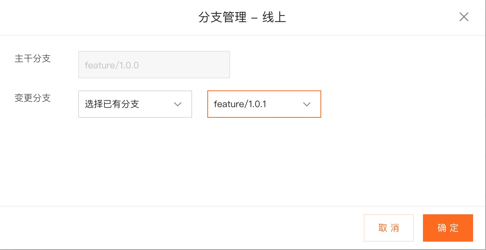

# Hexo

> A fast, simple & powerful blog framework, powered by [Node.js](https://nodejs.org).

[Website](https://hexo.io) |
[Documentation](https://hexo.io/docs/) |
[Installation Guide](https://hexo.io/docs/#Installation) |
[Contribution Guide](https://hexo.io/docs/contributing) |
[Code of Conduct](CODE_OF_CONDUCT.md) |
[API](https://hexo.io/api/) |
[Twitter](https://twitter.com/hexojs)

[](https://www.npmjs.com/package/hexo)

[](https://github.com/hexojs/hexo/actions?query=workflow%3ATester)
[](https://libraries.io/npm/hexo)
[](https://coveralls.io/r/hexojs/hexo?branch=master)
[](https://gitter.im/hexojs/hexo)
[](https://discord.gg/teM2Anj)
[](https://t.me/hexojs)
[](https://app.fossa.com/projects/git%2Bgithub.com%2Fhexojs%2Fhexo?ref=badge_shield)
[](CODE_OF_CONDUCT.md)

## Features

- Blazing fast generating
- Support for GitHub Flavored Markdown and most Octopress plugins
- One-command deploy to GitHub Pages, Heroku, etc.
- Powerful API for limitless extensibility
- Hundreds of [themes](https://hexo.io/themes/) & [plugins](https://hexo.io/plugins/)

## 一、Quick Start

**Install Hexo**

``` bash
$ npm install hexo-cli -g
```

**Setup your blog**

``` bash
$ hexo init blog
$ cd blog
```

**Start the server**

``` bash
$ hexo server
```

**Create a new post**

``` bash
$ hexo new "Hello Hexo"
```

**Generate static files**

``` bash
$ hexo generate
```

#### 然后将产物中的public文件夹上传到Github仓库即可<br>

## 二、如何将前端项目部署到云平台

### 1.配置GIthub

#### 1).绑定GitHub帐号

##### 依次点击以下按钮绑定Github帐号


#### 2).选择代码仓库

##### 绑定完成后选择想要部署的项目所在的代码仓库及主干分支并点击下一步


#### 3).填写应用的基本信息

##### 填写信息完成后将进入到开发部署界面


### 2.开发部署配置

#### 1).填写部署配置(以线上部署为例)
##### 按照"?"提示依次填写部署配置信息


#### 2).填写分支管理(以线上部署为例)
##### 可以按需选择新建分支和已有分支


#### 3). 进行项目的部署和查看
##### 项目在线上部署完成后即可查看

## 三、如何访问URL和绑定自定义域名

### 1.项目在部署上线后有公共读Object、私有Object和自有域名Object

#### 1).公共读Object
##### 如果文件的读写权限ACL为公共读，即该文件允许匿名访问，那么文件URL的格式为https://BucketName.Endpoint/ObjectName。其中，ObjectName需填写包含文件夹以及文件后缀在内的该文件的完整路径。
##### 例如华东1（杭州）地域下名为bucketexample的Bucket下有名为example的文件夹，文件夹内有个名为example.jpg的文件。则该文件URL为：
##### 外网访问URL：https://bucketexample.oss-cn-hangzhou.aliyuncs.com/example/example.jpg
##### 内网访问URL（供同地域ECS实例访问）：https://bucketexample.oss-cn-hangzhou-internal.aliyuncs.com/example/example.jpg

#### 2).私有Object
##### 如果文件读写权限ACL为私有，则必须进行签名操作。私有文件URL的格式为 https://BucketName.Endpoint/Object?签名参数。您可以通过以下任意方法获取文件URL并设置URL的有效时长。
##### 控制台
##### 您可以通过OSS控制台获取文件URL。具体操作，请参见分享文件。文件URL的有效时长因账号类型存在差异。例如，阿里云账号可设置的文件URL有效时长最大为32400秒（9小时），RAM用户以及STS用户可设置的文件URL有效时长最大为3600秒（1小时）。如需获取更长时效的文件URL，请使用命令行工具ossutil、图形化工具ossbrowser或SDK。
##### 命令行工具ossutil
##### 图形化工具ossbrowser

#### 3).自有域名Object
##### 自有域名Object即将文件所在bucket绑定已有自定义域名，文件URL的格式为https://YourDomainName/ObjectName，其中ObjectName需填写包含文件夹以及文件后缀在内的该文件的完整路径。
##### 例如您在华东1（杭州）地域下的存储空间bucketexample，绑定了自有域名img.example.com。且该bucket下有名为example的文件夹，文件夹内有名为example.jpg的文件，则该文件URL为https://img.example.com/example/example.jpg。

### 2.为bucket绑定域名
#### 绑定自定义域名。
##### 1).登录OSS管理控制台。
##### 2).单击Bucket列表，然后单击目标Bucket名称。
##### 3).单击传输管理 > 域名管理。
##### 4).单击绑定域名。
##### 5).在绑定域名面板，输入要绑定的域名。
##### 绑定的域名不支持泛域名，例如 *.example.com。
##### 若提示域名冲突，表示该域名已绑定至其他Bucket。此时，您可以更换域名或通过验证域名所有权强制绑定域名。验证域名所有权会解除域名与其他Bucket的绑定关系。详情请参见验证域名所有权。

#### 添加CNAME记录。
#### 如果添加的域名为当前账号下管理的域名，开启自动添加CNAME记录。
+ 在绑定域名面板，打开自动添加CNAME记录开关。
  ##### 注意 若您绑定的域名已配置过CNAME，则自动添加的CNAME记录会覆盖原有的CNAME记录。
+ 单击提交。
#### 如果添加的域名为非当前账号下的域名，手动添加CNAME记录。
+ 若您的域名为非阿里云托管的域名，需在对应的域名解析商处配置云解析，如腾讯云解析（原DNSPod）或新网，详情请参见配置CNAME。

#### 此处以非当前账号下阿里云托管的域名为例，手动添加CNAME记录步骤如下：

1. 登录云解析DNS控制台。
2. 在域名解析列表中，单击目标域名右侧的解析设置。
3. 单击添加记录，填写域名解析信息。
4. 单击确定,新增CNAME记录实时生效，修改CNAME记录最多72小时内生效。